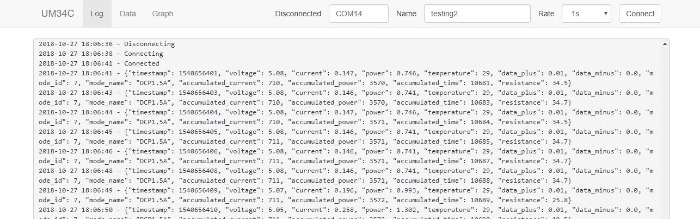
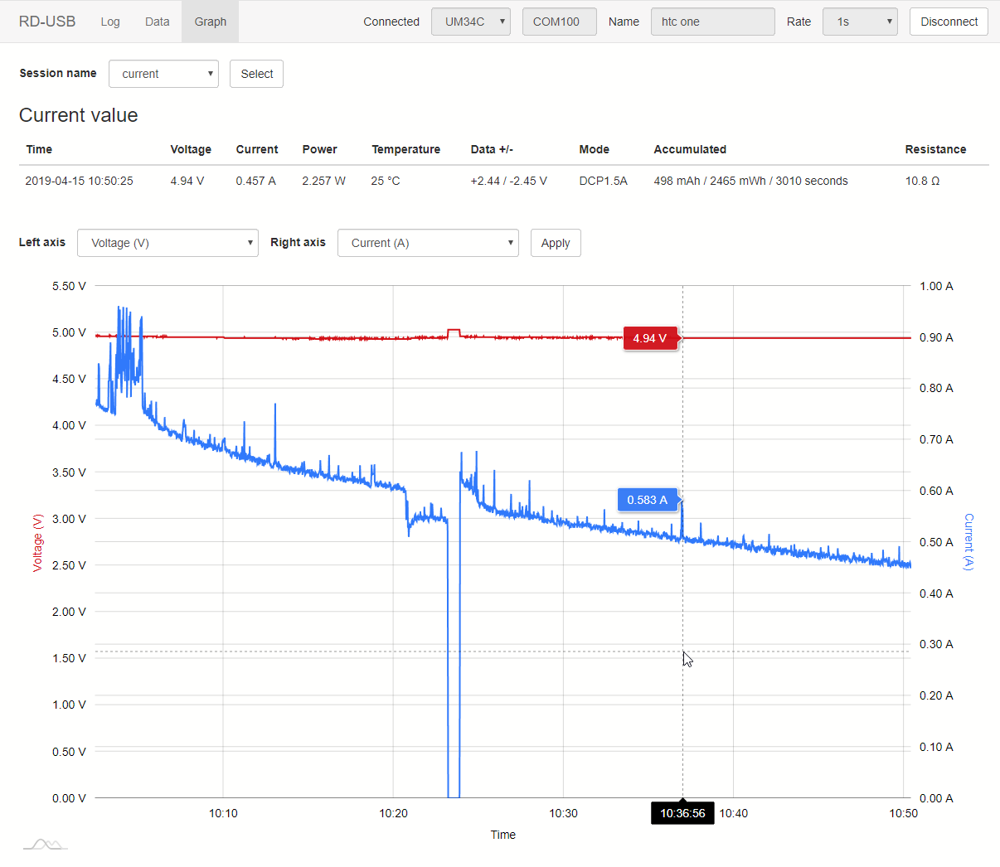
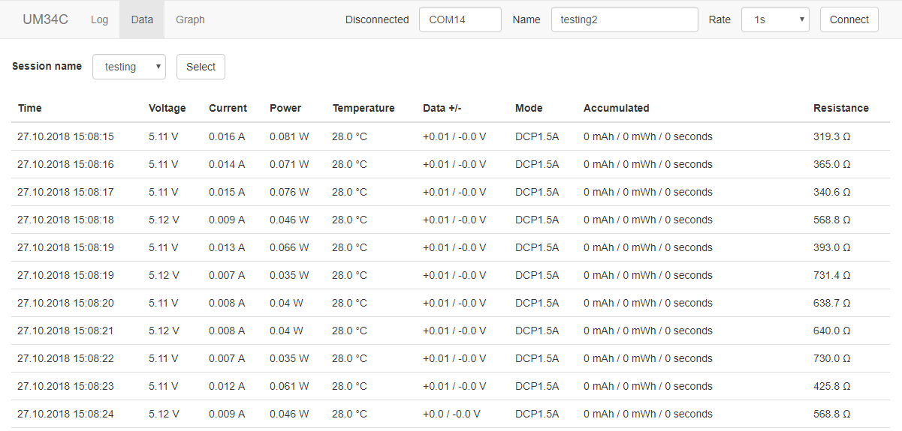

Web GUI for RuiDeng USB testers (UM34C, UM24C, UM25C, TC66C)
==

Simple web GUI written in Python 3. Measurements are stored in sqlite database. Tables and graphs are supported.
Live preview and graphing is also available.

Tested on UM34C/UM24C/UM25C/TC66C.

Based on https://github.com/sebastianha/um34c


Requirements
--
- UM34C/UM24C/UM25C - meter needs to be connected as serial port
    - Pairing with Windows Settings works fine. Pin is 1234. After successful pairing some serial ports are
    installed. In my case two. One of them works.
    - On Linux `rfcomm` and `hcitool` can be used (both provided by bluez package)
        - Retrieve bluetooth address with `hcitool scan`
        - Bind retrieved address to serial port with `rfcomm bind 0 aa:bb:cc:dd:ee:ff`. 
        This step is not persistent. Serial port will disappear after reboot. Also rd-usb needs to 
        have permissions to use /dev/rfcommX.
- TC66C - meter is using BLE instead of regular bluetooth so pairing will not work nor RFCOMM will.
    - BLE has very limited support on desktop devices, see used library for supported platforms and versions: 
    https://github.com/hbldh/bleak#features
- TC66C USB - meter connected with USB
    - Meter connected with USB exposes itself as serial port

Installation
--

### Binaries (Win x64 only)
- Download from [releases](https://github.com/kolinger/rd-usb/releases)
    - **rd-usb.exe** is CLI web server application. GUI is provided by web browser. 
    Run executable and web server will be shortly spawned on address http://127.0.0.1:5000.
    - **rd-usb-install.exe** is installer of standalone GUI application. Works without web browser.
    Embedded browser is used instead. External web browser still can be used with address (see above).
- Application will be probably blocked by Microsoft SmartScreen. For unblock click `More info`
and `Run anyway`. I don't have certificate for signing and application does not have any
reputation so Microsoft will block by default.

### Source code
1. Python 3.4 or newer is required
2. Download from github or `git clone https://github.com/kolinger/rd-usb.git`
3. Install requirements 
   - For Windows: `pip install -r requirements.txt`
   - For Linux `pip install -r requirements_linux.txt`
   - For Linux headless `pip install -r requirements_headless.txt` this version doesn't 
     contain dependencies for embedded browser GUI. This is useful if you plan to use CLI/webserver only.
     Also useful on ARM SBCs.
4. Run with `python web.py` - this will spawn web server on http://127.0.0.1:5000, port can be changed
with first argument: `python web.py 5555`

For additional arguments/options use --help: `python web.py --help`.

On Windows `python` can be found in Python's installation folder.
For example replace `python` with `C:\Python37\python.exe web.py`
and `pip` with `C:\Python37\python.exe -m pip install -r requirements.txt`.

On Linux use `python3` and `pip3`.

Usage
--

**UM34C/UM24C/UM25C Bluetooth or TC66C USB**
1. Select your device version.
2. Name your session. For example 'testing some power bank'. This is
   used to separate multiple measurements from each other.
3. Select sample rate. Faster sample rate will result in more accurate data but also
   will create a lot more data. For short measurements use faster sample rate. For longer
   use slower rate. Choose carefully.
4. Follow Setup link to find your serial port or click Connect if you already have port selected.
5. Connection will be hopefully successful and you will see live measurements in graph.
   Otherwise read log for error messages.

**TC66C Bluetooth**
1. Make sure your OS is supported and has bluetooth with BLE support (Bluetooth Low Energy)
2. Select TC66C from devices and follow with Setup link.
3. Scan for devices and select your device from list by clicking on it
4. After this you can connect simply by using Connect button. Setup is required only for new/different device.
5. Rest is same as other devices. See above.



Graphs
--




Tables
--



Custom export
--

Application has basic CSV export built-in. For more advanced use-cases external script can be used.

External program/script can be specified with `--on-receive` option.
This script will be executed when new data is received. 
New measurements are provided as JSON file. Path of this file is provided as first argument.

For managing overhead another option `--on-receive-interval` is available (default value is 60).
This number specified how often is external script called (in seconds, default value is every minute).
Value 0 means script will be called for every new measurement as they happen. 
Script is not called when no new measurements are available.

CLI example: `python web.py --on-receive on-receive.sh`

See `on-receive.sh` or `on-receive.cmd` files for more information how implement this program/script.

Example structure of JSON file:

```
[
    {
        "timestamp": 1599556295,
        "voltage": 5.12,
        "current": 0.0,
        "power": 0.0,
        "temperature": 25,
        "data_plus": 0.0,
        "data_minus": 0.0,
        "mode_id": 7,
        "mode_name": "DCP1.5A",
        "accumulated_current": 0,
        "accumulated_power": 0,
        "accumulated_time": 0,
        "resistance": 9999.9,
        "name": "measurement name"
    },
    ...
]
```

Development
--

### Building binaries

1. Install pyinstaller: `pip install pyinstaller` and [NSIS](https://nsis.sourceforge.io/Download) installer
2. Generate binaries: 
    - `pyinstaller pyinstaller-cli.spec`
    - `pyinstaller pyinstaller.spec`
    - `makensis.exe installer.nsi`
    - or use `build.cmd`
3. Binaries will be saved in `dist` directory
