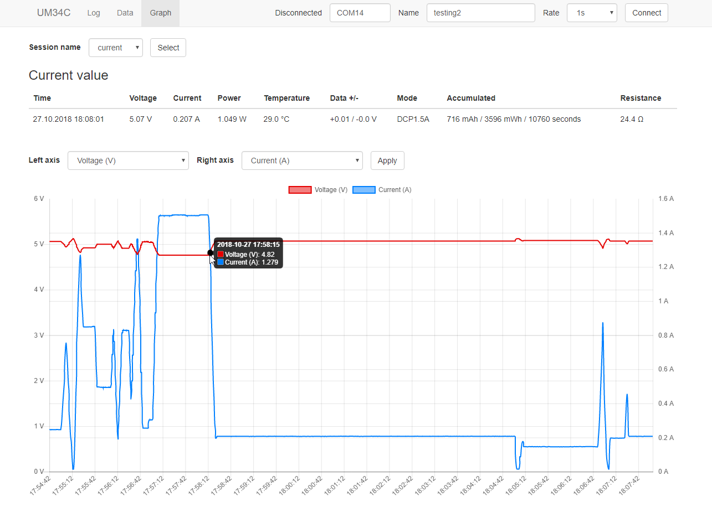

Web GUI for RuiDeng USB testers (UM34C, UM24C, UM25C) 
==

Simple web GUI written in Python 3. Measurements are stored in sqlite database. Tables and graphs are supported. 
Live preview and graphing is also available.

Tested on UM34C/UM24C/UM25C.

Based on https://github.com/sebastianha/um34c

Requirements
--
- USB meter needs to be connected as serial port
    - Pairing with Windows Settings works fine. After successful installation some serial ports are 
    installed in Device Manager. In my case two. One of them works.
    - On Linux `rfcomm` can be used

Installation
--

### Binaries (Win x64 only)
1. Download from [releases](https://github.com/kolinger/rd-usb/releases)
2. Extract archive
2. Run executable and web server will be shortly spawned on address http://127.0.0.1:5000
3. Application will be probably blocked by Microsoft SmartScreen. For unblock click `More info` 
and `Run anyway`. I don't have certificate for signing and application does not have any 
reputation so Microsoft will block by default.

### Source code
1. Python 3.6 or newer is required
2. Download from github or `git clone https://github.com/kolinger/rd-usb.git`
3. Install requirements `pip install -r requirements.txt`
4. Run with `python web.py` - this will spawn web server on http://127.0.0.1:5000, port can be changed 
with first argument: `python web.py 5555`

On Windows `python` can be found in Python's installation folder. 
For example replace `python` with `C:\Python37\python.exe web.py` 
and `pip` with `C:\Python37\python.exe -m pip install -r requirements.txt`.

On Linux use `python3` and `pip3`.

Usage
--

1. Find your serial port (in Device Manager) and fill serial port input.
2. Name your session. For example 'testing some power bank'. This is 
used to seperate multiple measurements from each other.
3. Select sample rate. Faster sample rate will result in more accurate data but also
will create a lot more data. For short measurements use faster sample rate. For longer 
use slower rate. Choose carefuly.
4. Click Connect
5. Connection will be hopefully successful and you will see measurements in log. 
Otherwise read log for error messages.

Graphs
--

Tables
--

Development
--

### Building binaries

1. Install pyinstaller: `pip install pyinstaller`
2. Generate binary with provided spec file: `pyinstaller pyinstaller.spec`
3. Binaries will be saved in `dist` directory
